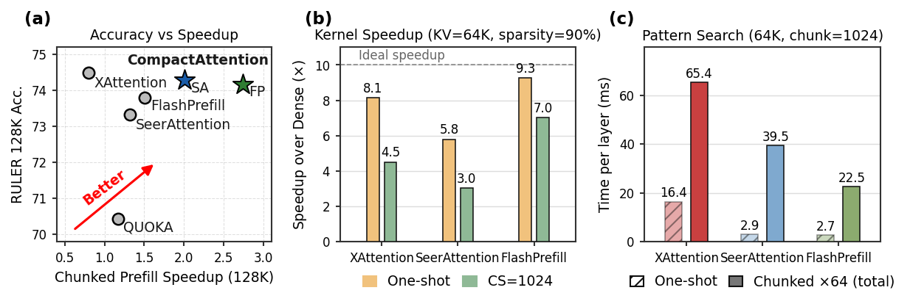
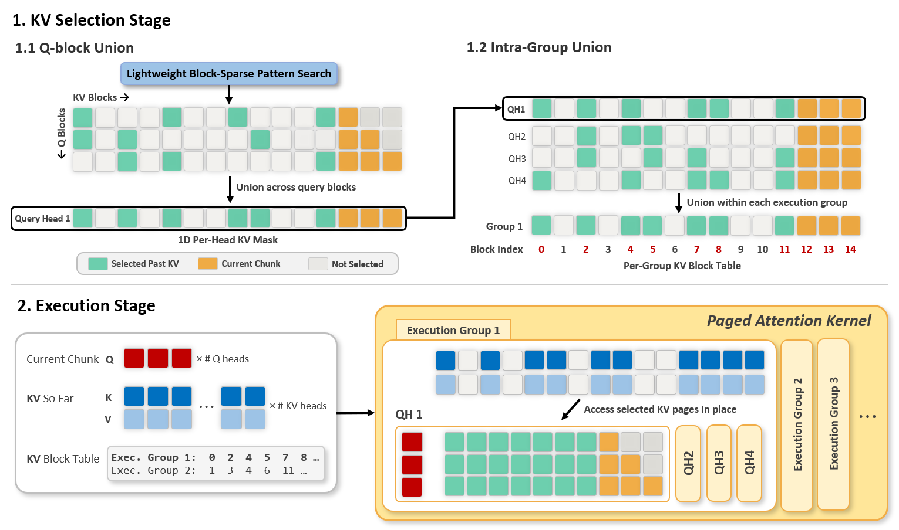
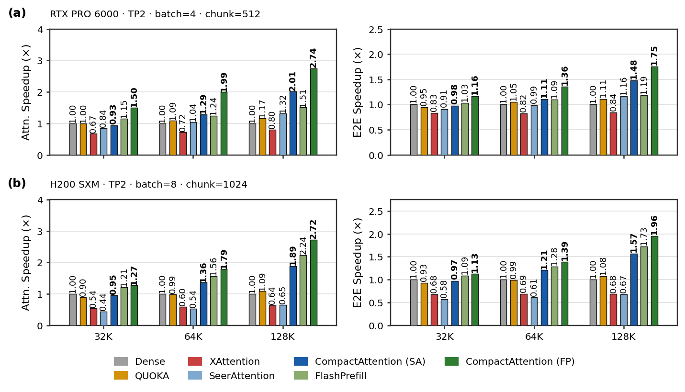
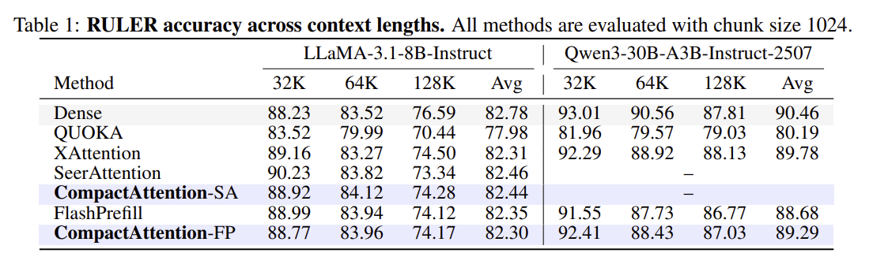

# CompactAttention: Accelerating Chunked Prefill with Block-Union KV Selection

Official implementation of the paper **"CompactAttention: Accelerating Chunked Prefill with Block-Union KV Selection"**

**CompactAttention** is a sparse-attention method designed for **chunked prefill** serving of long-context LLMs. It reframes 2D block-sparse masks as **KV-selection signals** and gathers a per-group KV block table so a dense FlashAttention kernel can do the work — recovering dense-kernel throughput while keeping full-attention accuracy.

🚀 Key Features
---------------

- **Built for Chunked Prefill**
  Targets the regime real serving systems run in — small query chunks attending to a long, growing KV cache — where one-shot sparse methods break down.

- **Block-Union KV Selection**
  Converts any 2D block-sparse mask into a GQA-aware per-group KV block table via Q-block union and intra-group union, with no sparse-kernel launch overhead.

- **Dense Kernel, Sparse Memory**
  Runs a dense FlashAttention over the selected KV blocks, trading a small amount of redundant work for much higher SM utilization at typical chunk sizes.

- **Selector-Agnostic**
  Plugs in on top of existing selectors — both training-free (XAttention-style) and learned (SeerAttention-style AttnGate) families are supported.

- **Up to 2.72× Attention Speedup**
  On LLaMA-3.1-8B-Instruct at 128K context, matches dense-attention accuracy on RULER while delivering up to **2.72×** attention speedup.

### Key Results

Usage
-----

🚧 **Code coming soon.**

Citation
--------

If you find Compact Attention relevant to your research, please cite our work:

    @article{compactattention,
      title={CompactAttention: Accelerating Chunked Prefill with Block-Union KV Selection},
      author={Jiwon Song, Dongwon Jo, Beomseok Kang, Jae-Joon Kim},
      journal={arXiv preprint arXiv:2605.16839},
      year={2026}
      }
